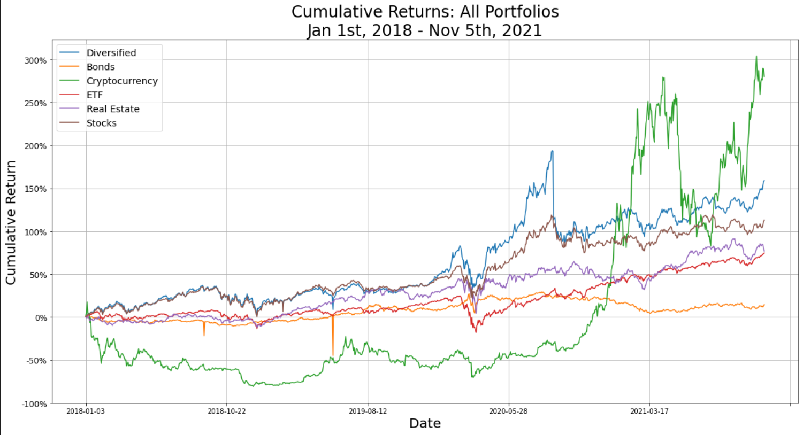
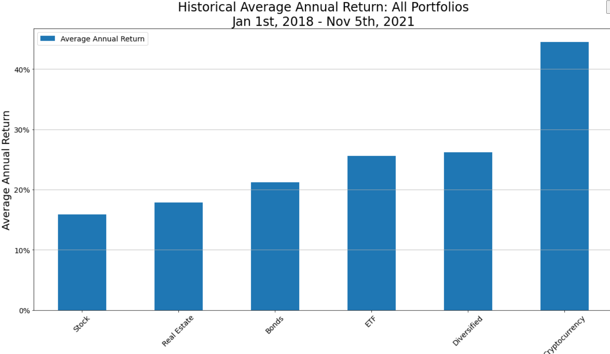
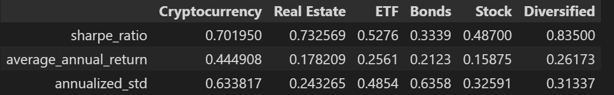

# Challenging the Status Quo
Analyzing the performance of 6 asset class portfolios. Does any asset class outperform a balanced diversified portfolio?

## Project Proposal

**[Project Proposal](proposal.txt)**

---

## Technologies

This project leverages python 3.7 with the following packages:

**[OS Library Python](https://docs.python.org/3/library/os.html)** - provides a portable way of using operating system dependent functionality.<br>

**[Requests Library Python](https://pypi.org/project/requests/)** - allows you to send HTTP/1.1 requests extremely easily.<br>

**[Pandas Library Python](https://pandas.pydata.org/)** - a fast, powerful, flexible and easy to use open source data analysis and manipulation tool.<br>

**[Dotenv Library Python](https://pypi.org/project/python-dotenv/)** - reads key-value pairs from a .env file and can set them as environment variables.<br>

**[Alpaca Trade API](https://alpaca.markets/docs/)** - allows for fast and easy fetching of stock market data with security keys.<br>

**[MCForecastTools Library](MCForecastTools.py)** - Monte Carlo Simulations to predict future performance of portfolios.<br>

**[Numpy Library Python](https://numpy.org/)** -  comprehensive mathematical functions.<br>

**[pathlib Library Python](https://pathlib.readthedocs.io/en/pep428/)** - offers a set of classes featuring all the common operations on paths in an easy, object-oriented way.

**[Matplotlib Python](https://matplotlib.org/)** - comprehensive library for creating static, animated, and interactive visualizations in Python.

---

## Installation Guide

Before running the application first install the following dependencies:

1) OS Library is included with Anaconda so no need to install.<br>

2) Requests Library is included with Anaconda so no need to install.<br>

3) Pandas Library is included with Anaconda so no need to install.<br>

4) In order to use the dotenv library, you must install it by writing this command in your terminal:

```python
pip install python-dotenv
```

To verify installation, type the following command in your terminal:

```python
conda list dotenv
```

A version number should appear, as follows:


4) In order to use the Alpaca Trade API, you must install it by typing this command in your terminal:

```python
pip3 install alpaca-trade-api
```

To verify installation, type the following command in your terminal:

```python
conda list alpaca
```

A version number should appear, as follows:


5) In order to use the MCForecastTools Library, all you have to do is copy the MCForecastTools.py library file into your repository or project.

6) Numpy Library is included with Anaconda so no need to install.<br>

7) pathlib is included with Anaconda so no need to install.<br>

8) Matplotlib is included with Anaconda so no need to install.<br>

The installation of libraries ans dependencies is now complete.

---

## Usage

To use the loan qualifier application simply clone the repository and run the **consolidated.ipynb** file with:

```python
python consolidated.ipynb
```

For best results, it is recommended to open as a Jupyter Notebook.

There are 7 Jupyter Notebooks comprising the application. They include the 6 different portfolio notebooks, and the main results notebook named consolidated.ipynb

We make our calculations in the respective portfilio notebook, and then consolidate them in consolidated.ipynb

In order to test different results, go to the specific notebook you are interested in adjusting and try different timeframes, tickers, and years of Monte Carlo Simulations. 

This version of the application will outline the results of data collected from the Alpaca Trade API between Jan. 1, 2018 and Nov. 5, 2021. 

We have 6 portfolios: Bond Portfolio, Stock Portfolio, Real Estate Portfolio, Cryptocurrency Portfolio, ETF Portfolio, and a Diversified Portfolio.

Once calculations are finalized, we can see the analysis below:

Consolidated Cumulative Returns:



The next apart of the analysis compares the historical returns of the portfolios:



We will conclude our analysis by creating a dataframe comparing each portfolio's Sharpe Ratio, Average Annual Return, and Annualized Standard Deviation



---

## Contributors

**Contributor:** Jacob Rougeau
**Email Address:** 

**Contributor:** Lindsey Hardouin
**Email Address:**

**Contributor:** Tony Landero<br>
**Email Adress:** mr.landero@gmail.com<br>

---

## License

MIT